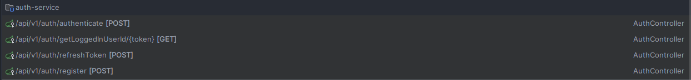

<a name="readme-top"></a>

<!-- PROJECT LOGO -->
<br />
<div align="center">
  <a href="https://github.com/kudzaiprichard/realestate-backend">
    
  </a>

  <h3 align="center">Coin Compass Microservice Api</h3>

  <p align="center">
    A microservice api for predicting cryptocurrency prices via machine learning
    <br/>
  </p>
  <br/>
</div>

<!-- TABLE OF CONTENTS -->
<details>
  <summary>Table of Contents</summary>
  <ol>
    <li>
      <a href="#about-the-project">About The Project</a>
      <ul>
        <li><a href="#project-scope">Project Scope</a></li>
        <li><a href="#project-design">Project Design</a></li>
         <ul>
            <li><a href="#api-gateway">Api Gateway</a></li>
            <li><a href="#auth-service">Auth Service</a></li>
            <li><a href="#config-service">Config Service</a></li>
            <li><a href="#crypto-service">Crypto Service</a></li>
            <li><a href="#favorite-service">Favorite Service</a></li>
            <li><a href="#predict-service">Predict Service</a></li>
            <li><a href="#profile-service">Profile Service</a></li>
            <li><a href="#service-registry">Service Registry</a></li>
         </ul>
         <li><a href="#machine-learning-model">Machine Learning Model</a></li>
        <li><a href="#built-with">Built With</a></li>
      </ul>
    </li>
    <li>
      <a href="#getting-started">Getting Started</a>
      <ul>
        <li><a href="#prerequisites">Prerequisites</a></li>
        <li><a href="#installation">Installation</a></li>
        <li><a href="#contributing">Contributing</a></li>
      </ul>
    </li>
    <li><a href="#license">License</a></li>
    <li><a href="#contact">Contact</a></li>
    <li><a href="#acknowledgments">Acknowledgments</a></li>
  </ol>
</details>

<!-- ABOUT THE PROJECT -->
# About The Project

### Project Scope

Project Description: Coin Compass is a microservice project designed to predict cryptocurrency prices 
using machine learning algorithms. It will integrate with various cryptocurrency data sources and leverage machine learning 
models to generate price forecasts for different time horizons.

#### Project Objectives:

* Develop a machine learning model capable of predicting cryptocurrency prices with acceptable accuracy.
* Design and implement a microservice architecture for real-time and efficient prediction delivery.
* Integrate with relevant cryptocurrency data sources to ensure access to historical and current market data.
* Provide an API for easy integration with other applications and platforms.
* Offer customizable prediction options based on user-defined parameters.


## Project Design

### Architecture
System uses a Microservice architecture. `But what are a Microservice?`

<div align="center">
    
</div>

A system is usually built in a Microservice or in a Monolith architecture manner.

#### Microservice
The microservice architecture, is a way of developing software that breaks down a large application into smaller, 
independent services. Each service has its own specific function and communicates with other services through well-defined 
interfaces, typically APIs. Here's a breakdown of the key characteristics:

<div align="center">
    
</div>

### Monolith 
This describes a single, unified software application containing all the features and functionalities within itself. 
Think of it as a large building with everything under one roof. It's typically self-contained and independent from other
applications. While simple to understand and manage initially, monolithic applications can become cumbersome and challenging 
to maintain and scale as they grow in complexity.

### Characteristics of a Microservice
<div align="center">
    
</div>

* `Split into numerous components` : Instead of a single large application, the system is divided into independent, 
small services each performing a specific task. These services communicate through well-defined APIs

* `Robust and resistant to failure` : Each service is designed to be isolated and self-contained, minimizing the impact 
of failures on the whole system.

* `Simple routing process` : The system utilizes a clear and efficient mechanism for directing requests to the appropriate 
service. This could involve API gateways, service meshes, or other routing strategies.
* 
* `Decentralized operations` : Each service can be managed and deployed independently, allowing for different teams and technologies to be used.

* `Built for morden business` : Microservices architecture aligns well with the flexible, dynamic, and scalable needs of modern businesses.


## Services
The fundamental building blocks of the entire system comprises 8 microservices with each services managing a particular task
below each service explained 


## Api Gateway
an API Gateway acts as the "front door" to your system, mediating the flow of requests between clients 
(like mobile apps or websites) and your various backend services.

* `Single entry point`: Clients interact with the API Gateway using a single, well-defined API instead of needing to know and connect to individual services directly. This simplifies client development and integration.
* `Traffic routing`: The API Gateway receives requests, identifies the appropriate target service based on defined rules (e.g., URL, headers), and routes the request accordingly.
* `Protocol translation`: It can act as a translator between different protocols used by clients and services, ensuring seamless communication despite variations.
* `Security enforcement`: The API Gateway can implement security policies, throttling, and authentication/authorization checks before forwarding requests to services, enhancing overall system security.
* `Monitoring and analytics`: It can collect and analyze data about incoming requests and responses, providing insights into API usage and system performance.

#### Api Endpoints
<div align="center">
    
</div>

### Auth Service
An Auth Service utilizing JWT (JSON Web Token) for role-based security plays a crucial role in managing user access 
and authorization. Here's a breakdown of its functionalities and considerations:

* `User registration and authentication`: Provides secure user registration and login options, potentially integrating with social media logins.
* `JWT token generation`: Upon successful authentication, generates a signed JWT token containing user information and assigned roles.
* `Token validation`: Validates incoming JWT tokens from other services, verifying their authenticity and expiration.
* `Role-based access control (RBAC)`: Associates user roles with specific permissions and enforces access restrictions based on these roles.
* `Token refresh`: Offers mechanisms to refresh expiring tokens without requiring users to re-authenticate.

#### Api Endpoints
<div align="center">
    
</div>

## Config Service
A Config Service acts as a central repository for all configuration settings needed by your individual services. 
This approach offers several advantages over hardcoding configurations within each service, leading to better
maintainability, flexibility, and centralized control.

* `Configuration storage`: Securely stores configuration data for various aspects of your services, including API keys, database connections, logging levels, feature flags, and other environment-specific settings.
* `Dynamic configuration updates`: Allows updating configurations without requiring individual service deployments, improving agility and reducing downtime.
* `Versioning and rollbacks`: Supports configuration versioning and rollback capabilities to enable reverting to previous configurations if needed.
* `Access control and security`: Implements access control mechanisms to restrict who can modify configurations and ensures secure access to sensitive data.

## Crypto Service
A Crypto Service responsible for connecting to Binance and retrieving real-time candlestick data plays a crucial role 
in generating timely predictions. Here's a breakdown of its functionalities and considerations:

* `Connection establishment`: Securely connects to the Binance API using appropriate authentication and authorization mechanisms.
* `Data retrieval`: Fetches real-time candlestick data for desired cryptocurrencies and timeframes specified by the system or user requests.
* `Data filtering and pre-processing`: Cleans and filters the raw data to ensure consistency and suitability for further processing.

#### Api Endpoints
<div align="center">
    
</div>

## Favorite Service
A Favorite Service in your Coin Compass project could act as a bookmarking system for users to keep track of 
their preferred cryptocurrencies. Here's how it might function:

* `Adding favorites`: Users can add cryptocurrencies to their personal list of favorites, potentially through an API or user interface.
* `Managing favorites`: Users can view, edit, or remove entries from their favorite list.

#### Api Endpoints
<div align="center">
    
</div>

## Predict Service
A Predict Service that takes crypto candle sticks and predicts price is a key component of your envisioned 
Coin Compass project. Here's a breakdown of its potential functionalities and considerations:

* `Data input`: Receives cryptocurrency candlestick data as input, which typically includes information like opening and closing prices, high and low prices, and trading volume for a specific timeframe.
* `Model access`: Accesses and utilizes a trained machine learning model specializing in cryptocurrency price prediction.
* `Prediction generation`: Based on the input data and the trained model, generates price predictions for a specified future timeframe.
* `Customization`: Might offer options to customize predictions based on different parameters like prediction horizon, technical indicators, or specific cryptocurrencies.
* `Output format`: Outputs the generated predictions in a structured format, potentially including confidence scores or prediction ranges.

#### Api Endpoints
Comprises a single POST endpoint - `api/v1/predict`

### Machine Learning model
## Usage
To use this project, simply run the crypto.py script:

python crypto.py
This will load the data, train the model, and generate the predicted vs actual volume graph.

## Dataset
The dataset used in this project is the Cryptocurrency Historical Prices dataset, which contains historical prices for various cryptocurrencies.
Dataset source here  https://www.kaggle.com/datasets/sudalairajkumar/cryptocurrencypricehistory?resource=download

#### Model
The supervised learning model used in this project is the Linear Regression model from the Scikit-learn library. This model is trained on the previous cryptocurrency volume data to predict the future volume.

#### Graph
The graph shows the predicted volume vs the actual volume for the cryptocurrency. This graph is generated using the Matplotlib library.
<div align="center">
    
</div>

* Second graph out put
<div align="center">
    
</div>

#### Profile Service
A Profile Service specifically designed to manage user data like name, date of birth (DOB), 
and other personal information would typically handle the following functionalities:

#### Data management:
* `Storing user data`: It securely stores user information like names, addresses, DOBs, contact details, preferences, and other relevant data based on the application's requirements.
* `Data access and updates`: Provides controlled access to authorized users or applications to retrieve, update, or delete user profiles or specific data elements.
* `Data validation and security`: Implements validation rules to ensure data accuracy and adheres to security best practices for user data protection.

#### Api Endpoints
<div align="center">
    
</div>

## Service Registry
A Service Registry acts as a centralized directory for all the individual services within the system. 
It stores information about each service, including its:

* `Name`: Unique identifier for the service.
* `Location`: Hostname and port number where the service is running.
* `Health status`: Whether the service is currently healthy and accepting requests.
* `Metadata`: Additional information about the service, such as its capabilities and version.

<div align="center">
    
</div>

### Built With
The microservices are built using below technologies
1. `Languages`:  Java, Python, SQL, NoSQL

<div>
   
   
   
</div>

2. `Frameworks`: Spring Boot, Flask, Sklearn
<div>
   
   
</div>

3. `Database`:   MySQL, MongoDB
<div>
   
   
</div>

4. `Tools`:      Docker, Postman, Anaconda
<div>
   
   
   
</div>

<p align="right">(<a href="#readme-top">back to top</a>)</p>

<!-- GETTING STARTED -->
## Getting Started

### Prerequisites

You should have the below software installed in your pc :
* Python3
* Java 21
* Anaconda
* Flask
* XAMPP 8
* MongoDB
* and your preferred IDE or text editor


### Installation

1. Get a free API Key at [https://github.com/settings/tokens](https://github.com/settings/tokens)
2. Clone the repo

   ```sh
   git clone https://github.com/kudzaiprichard/coin-compass.git
   ```
3. Open project in desired IDE or text editor

> For the predict service: flask, python

1. Create a python environment
    ```shell
    python -m venv myenv
    ```
   
2. Activate created environment
    ```shell
    source myenv/bin/activate
    ```
   
3. Install required python packages
    ```shell
    pip install -r requirements.txt
    ```
   
4. You can now run the system using below flask command
    ```shell
    flask run
    ```

> For the other services, java, spring boot
1. Open the services with IDE or Text editor
2. Maven will load the project packages and project configurations

> NB: make sure your connected online

<p align="right">(<a href="#readme-top">back to top</a>)</p>

<!--CONTRIBUTING-->
## Contributing

If you have a suggestion that would make this better, please fork the repo and create a pull request. You can also simply open an issue with the tag "enhancement".
Don't forget to give the project a star! Thanks again!

1. Fork the Project
2. Create your Feature Branch (`git checkout -b feature/AmazingFeature`)
3. Commit your Changes (`git commit -m 'Add some AmazingFeature'`)
4. Push to the Branch (`git push origin feature/AmazingFeature`)
5. Open a Pull Request

### :fire: Contribution

Your contributions are always welcome and appreciated. Following are the things you can do to contribute to this project.

1. **Report a bug** <br>
   If you think you have encountered a bug, and I should know about it, feel free to report it [here]() and I will take care of it.

2. **Request a feature** <br>
   You can also request for a feature [here](), and if it will viable, it will be picked for development.

3. **Create a pull request** <br>
   It can't get better than this, your pull request will be appreciated by the community. You can get started by picking up any open issues from [here]() and make a pull request.

> If you are new to open-source, make sure to check read more about it [here](https://www.digitalocean.com/community/tutorial_series/an-introduction-to-open-source) and learn more about creating a pull request [here](https://www.digitalocean.com/community/tutorials/how-to-create-a-pull-request-on-github).

<p align="right">(<a href="#readme-top">back to top</a>)</p>

<!-- LICENSE -->
## License

> Distributed under the MIT License. See `LICENSE.txt` for more information.

<p align="right">(<a href="#readme-top">back to top</a>)</p>


<!-- CONTACT -->
## Contact

> Kudzai P Matizirofa - [linkedin.com/in/kudzai-prichard](https://linkedin.com/in/kudzai-prichard) - <kudzaiprichard@gmail.com>

Project Link: [https://github.com/kudzaiprichard/coin-compass.git](https://github.com/kudzaiprichard/coin-compass.git)

<p align="right">(<a href="#readme-top">back to top</a>)</p>

<!-- ACKNOWLEDGMENTS -->
## Acknowledgments

list of resources I found helpful and would like to give credit to.

* [Choose an Open Source License](https://choosealicense.com)
* [Spring boot documentation](https://docs.spring.io/spring-boot/docs/current/reference/htmlsingle/)
* [Python3 documentation](https://docs.python.org/)
* [Rest API with flask](https://pythonbasics.org/flask-rest-api/)
* [Flask Documentation](https://flask.palletsprojects.com/)
* [Linear Regression](https://www.ibm.com/topics/linear-regression#:~:text=Linear%20regression%20analysis%20is%20used,is%20called%20the%20independent%20variable.)
* [GitHub Pages](https://pages.github.com)

<p align="right">(<a href="#readme-top">back to top</a>)</p>
